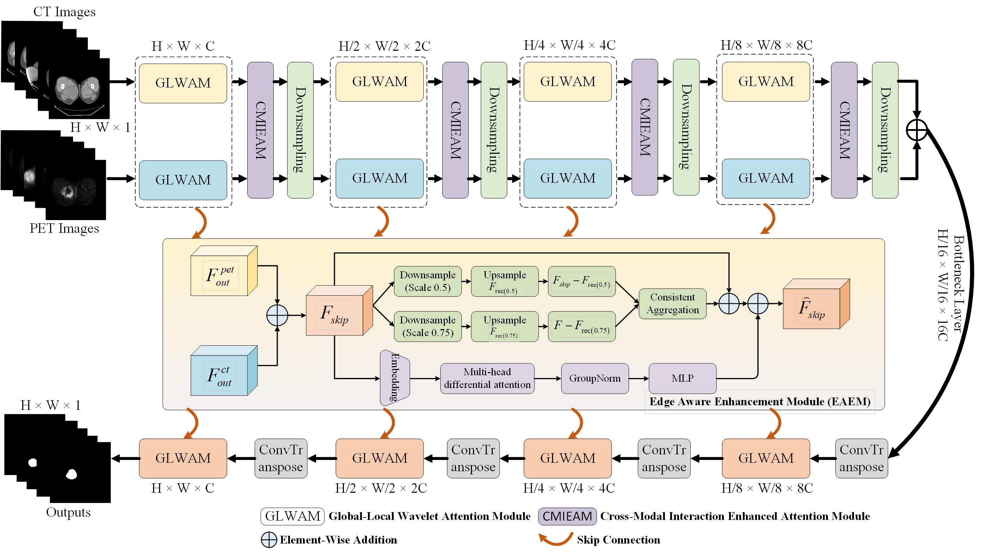

# Code-Implementation-WaveEdge-Net
Official implementation of WaveEdge-Net

# WaveEdge-Net



**"WaveEdge-Net: Hybrid Wavelet Attention and Edge-Aware Enhancement for Automatic Tumor Segmentation"**

The remaining source code is still undergoing code sorting and standardization. It will be released later.

## Requirements

1. os
2. argparse
3. random
4. shutil
5. csv
6. math
7. numpy
8. scipy
9. PIL
10. torch
11. torchvision
12. thop
13. pywt
14. SimpleITK
15. opencv-python
16. scikit-learn

## Datasets

In this work, we evaluate the proposed WaveEdge-Net on two PET/CT tumor segmentation datasets.

[1] Martin Vallieres, Carolyn R Freeman, Sonia R Skamene, and Issam El Naqa.
A radiomics model from joint FDG-PET and MRI texture features for the prediction of lung metastases in soft-tissue sarcomas of the extremities.
*Physics in Medicine & Biology*, 60(14):5471, 2015.

[2] Valentin Oreiller, Vincent Andrearczyk, Mario Jreige, Sarah Boughdad, Heshmat Elhalawani, Joel Castelli, Martin Vallières, et al.
Head and neck tumor segmentation in PET/CT: The HECKTOR challenge.
*Medical Image Analysis*, 77:102336, 2022.
https://hecktor.grand-challenge.org/

Please download the datasets from the official sources and organize them according to the required directory structure.

## Dataset Structure

The processed dataset can be organized as follows:

```text
dataset/
├── STS/
│   ├── images/
│   │   ├── ct/
│   │   └── pet/
│   └── masks/
└── Hecktor2022/
    ├── images/
    │   ├── ct/
    │   └── pet/
    └── masks/
```

## Train the Model

```bash
python train.py
```

## Test the Model

```bash
python test.py
```


## License

This project is released under the MIT License.
